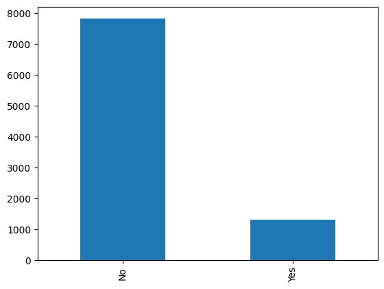
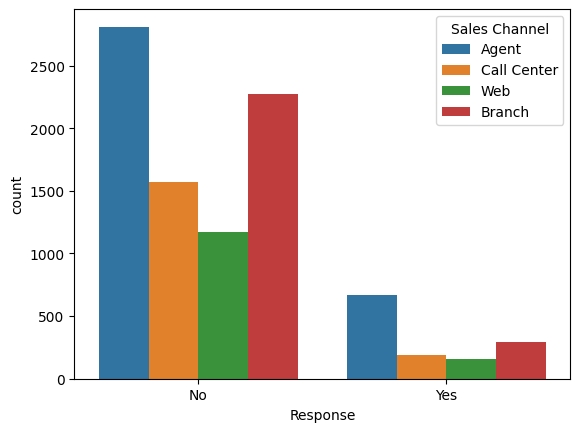
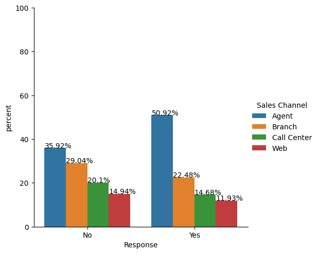
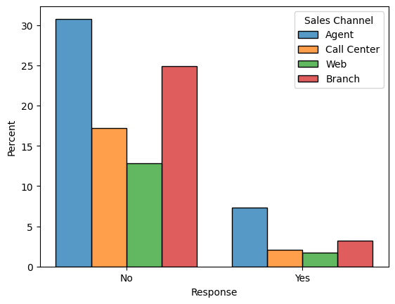
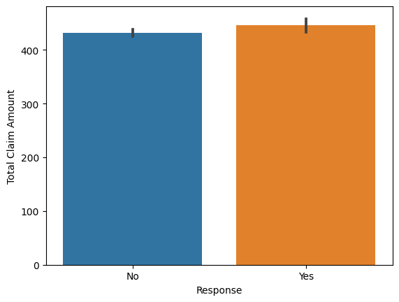
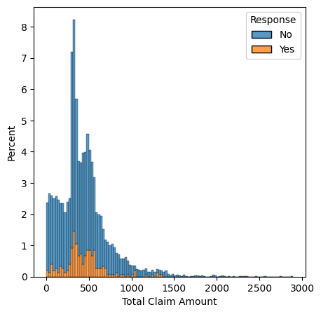
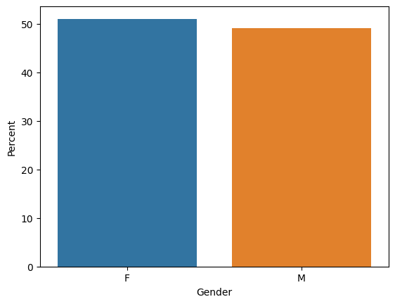
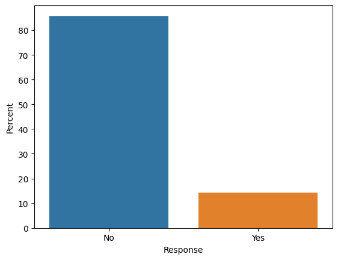
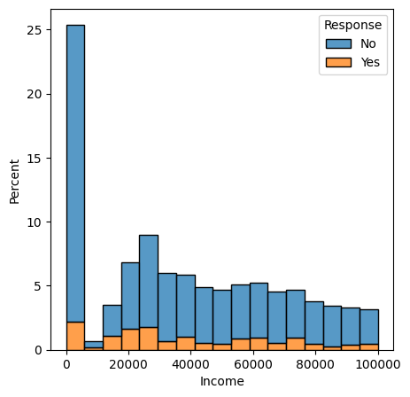

```python
# Lab | Customer Analysis Round 3

#For this lab, we still keep using the `marketing_customer_analysis.csv` file. You can find the file in the `files_for_lab` folder.

### Get the data

## - Use the same jupyter file from the last lab, `Customer Analysis Round 3`

### EDA (Exploratory Data Analysis) - Complete the following tasks to explore the data:

 ## - Show DataFrame info.
## - Describe DataFrame.
## - Show a plot of the total number of responses.
##- Show a plot of the response rate by the sales channel.
## - Show a plot of the response rate by the total claim amount.
##- Show a plot of the response rate by income.

```


```python
import pandas as pd
import numpy as np
import matplotlib.pyplot as plt
import seaborn as sns
import scipy.stats as stats
pd.set_option('display.max_columns', None) # displays all columns in dfs
#%matplotlib inline
import warnings
import plotly.express as px

warnings.filterwarnings('ignore') # no more warnings 
```


```python
#import data
data = pd.read_csv('marketing_customer_analysis.csv')


```


```python
# data.dtypes
data.info()
```

    <class 'pandas.core.frame.DataFrame'>
    RangeIndex: 9134 entries, 0 to 9133
    Data columns (total 24 columns):
     #   Column                         Non-Null Count  Dtype  
    ---  ------                         --------------  -----  
     0   Customer                       9134 non-null   object 
     1   State                          9134 non-null   object 
     2   Customer Lifetime Value        9134 non-null   float64
     3   Response                       9134 non-null   object 
     4   Coverage                       9134 non-null   object 
     5   Education                      9134 non-null   object 
     6   Effective To Date              9134 non-null   object 
     7   EmploymentStatus               9134 non-null   object 
     8   Gender                         9134 non-null   object 
     9   Income                         9134 non-null   int64  
     10  Location Code                  9134 non-null   object 
     11  Marital Status                 9134 non-null   object 
     12  Monthly Premium Auto           9134 non-null   int64  
     13  Months Since Last Claim        9134 non-null   int64  
     14  Months Since Policy Inception  9134 non-null   int64  
     15  Number of Open Complaints      9134 non-null   int64  
     16  Number of Policies             9134 non-null   int64  
     17  Policy Type                    9134 non-null   object 
     18  Policy                         9134 non-null   object 
     19  Renew Offer Type               9134 non-null   object 
     20  Sales Channel                  9134 non-null   object 
     21  Total Claim Amount             9134 non-null   float64
     22  Vehicle Class                  9134 non-null   object 
     23  Vehicle Size                   9134 non-null   object 
    dtypes: float64(2), int64(6), object(16)
    memory usage: 1.7+ MB


```python
data.head
```


    <bound method NDFrame.head of      Customer       State  Customer Lifetime Value Response  Coverage  \
    0     BU79786  Washington              2763.519279       No     Basic   
    1     QZ44356     Arizona              6979.535903       No  Extended   
    2     AI49188      Nevada             12887.431650       No   Premium   
    3     WW63253  California              7645.861827       No     Basic   
    4     HB64268  Washington              2813.692575       No     Basic   
    ...       ...         ...                      ...      ...       ...   
    9129  LA72316  California             23405.987980       No     Basic   
    9130  PK87824  California              3096.511217      Yes  Extended   
    9131  TD14365  California              8163.890428       No  Extended   
    9132  UP19263  California              7524.442436       No  Extended   
    9133  Y167826  California              2611.836866       No  Extended   
    
         Education Effective To Date EmploymentStatus Gender  Income  \
    0     Bachelor           2/24/11         Employed      F   56274   
    1     Bachelor           1/31/11       Unemployed      F       0   
    2     Bachelor           2/19/11         Employed      F   48767   
    3     Bachelor           1/20/11       Unemployed      M       0   
    4     Bachelor            2/3/11         Employed      M   43836   
    ...        ...               ...              ...    ...     ...   
    9129  Bachelor           2/10/11         Employed      M   71941   
    9130   College           2/12/11         Employed      F   21604   
    9131  Bachelor            2/6/11       Unemployed      M       0   
    9132   College            2/3/11         Employed      M   21941   
    9133   College           2/14/11       Unemployed      M       0   
    
         Location Code Marital Status  Monthly Premium Auto  \
    0         Suburban        Married                    69   
    1         Suburban         Single                    94   
    2         Suburban        Married                   108   
    3         Suburban        Married                   106   
    4            Rural         Single                    73   
    ...            ...            ...                   ...   
    9129         Urban        Married                    73   
    9130      Suburban       Divorced                    79   
    9131      Suburban         Single                    85   
    9132      Suburban        Married                    96   
    9133      Suburban         Single                    77   
    
          Months Since Last Claim  Months Since Policy Inception  \
    0                          32                              5   
    1                          13                             42   
    2                          18                             38   
    3                          18                             65   
    4                          12                             44   
    ...                       ...                            ...   
    9129                       18                             89   
    9130                       14                             28   
    9131                        9                             37   
    9132                       34                              3   
    9133                        3                             90   
    
          Number of Open Complaints  Number of Policies     Policy Type  \
    0                             0                   1  Corporate Auto   
    1                             0                   8   Personal Auto   
    2                             0                   2   Personal Auto   
    3                             0                   7  Corporate Auto   
    4                             0                   1   Personal Auto   
    ...                         ...                 ...             ...   
    9129                          0                   2   Personal Auto   
    9130                          0                   1  Corporate Auto   
    9131                          3                   2  Corporate Auto   
    9132                          0                   3   Personal Auto   
    9133                          0                   1  Corporate Auto   
    
                Policy Renew Offer Type Sales Channel  Total Claim Amount  \
    0     Corporate L3           Offer1         Agent          384.811147   
    1      Personal L3           Offer3         Agent         1131.464935   
    2      Personal L3           Offer1         Agent          566.472247   
    3     Corporate L2           Offer1   Call Center          529.881344   
    4      Personal L1           Offer1         Agent          138.130879   
    ...            ...              ...           ...                 ...   
    9129   Personal L1           Offer2           Web          198.234764   
    9130  Corporate L3           Offer1        Branch          379.200000   
    9131  Corporate L2           Offer1        Branch          790.784983   
    9132   Personal L2           Offer3        Branch          691.200000   
    9133  Corporate L3           Offer4   Call Center          369.600000   
    
          Vehicle Class Vehicle Size  
    0      Two-Door Car      Medsize  
    1     Four-Door Car      Medsize  
    2      Two-Door Car      Medsize  
    3               SUV      Medsize  
    4     Four-Door Car      Medsize  
    ...             ...          ...  
    9129  Four-Door Car      Medsize  
    9130  Four-Door Car      Medsize  
    9131  Four-Door Car      Medsize  
    9132  Four-Door Car        Large  
    9133   Two-Door Car      Medsize  
    
    [9134 rows x 24 columns]>


```python
## - Describe DataFrame.
data.describe()
```


<div>
<style scoped>
    .dataframe tbody tr th:only-of-type {
        vertical-align: middle;
    }

    .dataframe tbody tr th {
        vertical-align: top;
    }

    .dataframe thead th {
        text-align: right;
    }
</style>
<table border="1" class="dataframe">
  <thead>
    <tr style="text-align: right;">
      <th></th>
      <th>Customer Lifetime Value</th>
      <th>Income</th>
      <th>Monthly Premium Auto</th>
      <th>Months Since Last Claim</th>
      <th>Months Since Policy Inception</th>
      <th>Number of Open Complaints</th>
      <th>Number of Policies</th>
      <th>Total Claim Amount</th>
    </tr>
  </thead>
  <tbody>
    <tr>
      <th>count</th>
      <td>9134.000000</td>
      <td>9134.000000</td>
      <td>9134.000000</td>
      <td>9134.000000</td>
      <td>9134.000000</td>
      <td>9134.000000</td>
      <td>9134.000000</td>
      <td>9134.000000</td>
    </tr>
    <tr>
      <th>mean</th>
      <td>8004.940475</td>
      <td>37657.380009</td>
      <td>93.219291</td>
      <td>15.097000</td>
      <td>48.064594</td>
      <td>0.384388</td>
      <td>2.966170</td>
      <td>434.088794</td>
    </tr>
    <tr>
      <th>std</th>
      <td>6870.967608</td>
      <td>30379.904734</td>
      <td>34.407967</td>
      <td>10.073257</td>
      <td>27.905991</td>
      <td>0.910384</td>
      <td>2.390182</td>
      <td>290.500092</td>
    </tr>
    <tr>
      <th>min</th>
      <td>1898.007675</td>
      <td>0.000000</td>
      <td>61.000000</td>
      <td>0.000000</td>
      <td>0.000000</td>
      <td>0.000000</td>
      <td>1.000000</td>
      <td>0.099007</td>
    </tr>
    <tr>
      <th>25%</th>
      <td>3994.251794</td>
      <td>0.000000</td>
      <td>68.000000</td>
      <td>6.000000</td>
      <td>24.000000</td>
      <td>0.000000</td>
      <td>1.000000</td>
      <td>272.258244</td>
    </tr>
    <tr>
      <th>50%</th>
      <td>5780.182197</td>
      <td>33889.500000</td>
      <td>83.000000</td>
      <td>14.000000</td>
      <td>48.000000</td>
      <td>0.000000</td>
      <td>2.000000</td>
      <td>383.945434</td>
    </tr>
    <tr>
      <th>75%</th>
      <td>8962.167041</td>
      <td>62320.000000</td>
      <td>109.000000</td>
      <td>23.000000</td>
      <td>71.000000</td>
      <td>0.000000</td>
      <td>4.000000</td>
      <td>547.514839</td>
    </tr>
    <tr>
      <th>max</th>
      <td>83325.381190</td>
      <td>99981.000000</td>
      <td>298.000000</td>
      <td>35.000000</td>
      <td>99.000000</td>
      <td>5.000000</td>
      <td>9.000000</td>
      <td>2893.239678</td>
    </tr>
  </tbody>
</table>
</div>


```python

```


```python
## - Show a plot of the total number of responses.

data['Response'].value_counts().plot(kind='bar')

```


    <AxesSubplot: >


    

    


```python
#sns.boxplot(x='median_home_val', y='gender', data = data)
#plt.show()
```


```python
##- Show a plot of the response rate by the sales channel.

#plt.figure(figsize=(16,16))

#data['Response'].value_counts().plot(kind='bar')

p = sns.countplot(data=data, x='Response', hue='Sales Channel')


#sns.barplot(x="Response", hue='Sales Channel', data=data)
#plt.show()
```


    

    


```python
##- Show a plot of the response rate by the sales channel.


df = data

x,y = 'Response', 'Sales Channel'

df1 = df.groupby(x)[y].value_counts(normalize=True)
df1 = df1.mul(100)
df1 = df1.rename('percent').reset_index()

g = sns.catplot(x=x,y='percent',hue=y,kind='bar',data=df1)
g.ax.set_ylim(0,100)

for p in g.ax.patches:
    txt = str(p.get_height().round(2)) + '%'
    txt_x = p.get_x() 
    txt_y = p.get_height()
    g.ax.text(txt_x,txt_y,txt)
```


    

    


```python
sns.histplot(data, x="Response", hue="Sales Channel", stat="percent", multiple="dodge", shrink=.8)

```


    <AxesSubplot: xlabel='Response', ylabel='Percent'>


    

    


```python
## - Show a plot of the response rate by the total claim amount.

 
sns.barplot(x="Response", y="Total Claim Amount", data=data)

 
 
```


    <AxesSubplot: xlabel='Response', ylabel='Total Claim Amount'>


    

    


```python
## - Show a plot of the response rate by the total claim amount.

#plt.hist(data['Total Claim Amount'], weights=np.ones(len(data)) / len(data), edgecolor='black')

#sns.barplot(x="Response", y="Total Claim Amount", data=data)
#plt.show()


fig, axs = plt.subplots(figsize=(5, 5))

sns.histplot(
    data,
    x = "Total Claim Amount",
    hue = "Response",
    multiple = "stack",
    stat = "percent"
)
```


    <AxesSubplot: xlabel='Total Claim Amount', ylabel='Percent'>


    

    


```python

ax = sns.barplot(x="Gender", y="Monthly Premium Auto", data=data, estimator=lambda x: len(x) / len(data) * 100)
ax.set(ylabel="Percent")


```


    [Text(0, 0.5, 'Percent')]


    

    


```python
##- Show a plot of the response rate by income.

#sns.barplot(x="Response", y="Income", data=data)

ax = sns.barplot(x="Response", y="Income", data=data, estimator=lambda x: len(x) / len(data) * 100)
ax.set(ylabel="Percent")

```


    [Text(0, 0.5, 'Percent')]


    

    


```python
##- Show a plot of the response rate by income.


fig, axs = plt.subplots(figsize=(5, 5))

sns.histplot(
    data,
    x = "Income",
    hue = "Response",
    multiple = "stack",
    stat = "percent"
)
```


    <AxesSubplot: xlabel='Income', ylabel='Percent'>


    

    


