```python
In today's lesson we talked about continuous distributions (mainly normal distribution), linear regression and how multicollinearity can impact the model. In this lab, we will test your knowledge on those things using the marketing_customer_analysis.csv file. You have been using the same data in the previous labs (round 2 and 3). You can continue using the same jupyter file. The file can be found in the files_for_lab folder.

Get the data
Use the jupyter file from the last lab (Customer Analysis Round 3)

Complete the following tasks
Check the data types of the columns. Get the numeric data into dataframe called numerical and categorical columns in a dataframe called categoricals. (You can use np.number and np.object to select the numerical data types and categorical data types respectively)
Now we will try to check the normality of the numerical variables visually
Use seaborn library to construct distribution plots for the numerical variables
Use Matplotlib to construct histograms
Do the distributions for different numerical variables look like a normal distribution
For the numerical variables, check the multicollinearity between the features. Please note that we will use the column total_claim_amount later as the target variable.
Drop one of the two features that show a high correlation between them (greater than 0.9). Write code for both the correlation matrix and for seaborn heatmap. If there is no pair of features that have a high correlation, then do not drop any features
```


```python
import pandas as pd
import numpy as np
pd.set_option('display.max_columns', None)
from scipy import stats
import warnings
warnings.filterwarnings('ignore')
import matplotlib.pyplot as plt
import seaborn as sns 
%matplotlib inline

from sklearn.preprocessing import Normalizer
from sklearn.preprocessing import MinMaxScaler
from sklearn.preprocessing import StandardScaler

from sklearn.linear_model import LinearRegression
from sklearn.metrics import mean_squared_error, r2_score, mean_absolute_error

data = pd.read_csv('marketing_customer_analysis.csv', sep=",")
data.head()
```


<div>
<style scoped>
    .dataframe tbody tr th:only-of-type {
        vertical-align: middle;
    }

    .dataframe tbody tr th {
        vertical-align: top;
    }

    .dataframe thead th {
        text-align: right;
    }
</style>
<table border="1" class="dataframe">
  <thead>
    <tr style="text-align: right;">
      <th></th>
      <th>Customer</th>
      <th>State</th>
      <th>Customer Lifetime Value</th>
      <th>Response</th>
      <th>Coverage</th>
      <th>Education</th>
      <th>Effective To Date</th>
      <th>EmploymentStatus</th>
      <th>Gender</th>
      <th>Income</th>
      <th>Location Code</th>
      <th>Marital Status</th>
      <th>Monthly Premium Auto</th>
      <th>Months Since Last Claim</th>
      <th>Months Since Policy Inception</th>
      <th>Number of Open Complaints</th>
      <th>Number of Policies</th>
      <th>Policy Type</th>
      <th>Policy</th>
      <th>Renew Offer Type</th>
      <th>Sales Channel</th>
      <th>Total Claim Amount</th>
      <th>Vehicle Class</th>
      <th>Vehicle Size</th>
    </tr>
  </thead>
  <tbody>
    <tr>
      <th>0</th>
      <td>BU79786</td>
      <td>Washington</td>
      <td>2763.519279</td>
      <td>No</td>
      <td>Basic</td>
      <td>Bachelor</td>
      <td>2/24/11</td>
      <td>Employed</td>
      <td>F</td>
      <td>56274</td>
      <td>Suburban</td>
      <td>Married</td>
      <td>69</td>
      <td>32</td>
      <td>5</td>
      <td>0</td>
      <td>1</td>
      <td>Corporate Auto</td>
      <td>Corporate L3</td>
      <td>Offer1</td>
      <td>Agent</td>
      <td>384.811147</td>
      <td>Two-Door Car</td>
      <td>Medsize</td>
    </tr>
    <tr>
      <th>1</th>
      <td>QZ44356</td>
      <td>Arizona</td>
      <td>6979.535903</td>
      <td>No</td>
      <td>Extended</td>
      <td>Bachelor</td>
      <td>1/31/11</td>
      <td>Unemployed</td>
      <td>F</td>
      <td>0</td>
      <td>Suburban</td>
      <td>Single</td>
      <td>94</td>
      <td>13</td>
      <td>42</td>
      <td>0</td>
      <td>8</td>
      <td>Personal Auto</td>
      <td>Personal L3</td>
      <td>Offer3</td>
      <td>Agent</td>
      <td>1131.464935</td>
      <td>Four-Door Car</td>
      <td>Medsize</td>
    </tr>
    <tr>
      <th>2</th>
      <td>AI49188</td>
      <td>Nevada</td>
      <td>12887.431650</td>
      <td>No</td>
      <td>Premium</td>
      <td>Bachelor</td>
      <td>2/19/11</td>
      <td>Employed</td>
      <td>F</td>
      <td>48767</td>
      <td>Suburban</td>
      <td>Married</td>
      <td>108</td>
      <td>18</td>
      <td>38</td>
      <td>0</td>
      <td>2</td>
      <td>Personal Auto</td>
      <td>Personal L3</td>
      <td>Offer1</td>
      <td>Agent</td>
      <td>566.472247</td>
      <td>Two-Door Car</td>
      <td>Medsize</td>
    </tr>
    <tr>
      <th>3</th>
      <td>WW63253</td>
      <td>California</td>
      <td>7645.861827</td>
      <td>No</td>
      <td>Basic</td>
      <td>Bachelor</td>
      <td>1/20/11</td>
      <td>Unemployed</td>
      <td>M</td>
      <td>0</td>
      <td>Suburban</td>
      <td>Married</td>
      <td>106</td>
      <td>18</td>
      <td>65</td>
      <td>0</td>
      <td>7</td>
      <td>Corporate Auto</td>
      <td>Corporate L2</td>
      <td>Offer1</td>
      <td>Call Center</td>
      <td>529.881344</td>
      <td>SUV</td>
      <td>Medsize</td>
    </tr>
    <tr>
      <th>4</th>
      <td>HB64268</td>
      <td>Washington</td>
      <td>2813.692575</td>
      <td>No</td>
      <td>Basic</td>
      <td>Bachelor</td>
      <td>2/3/11</td>
      <td>Employed</td>
      <td>M</td>
      <td>43836</td>
      <td>Rural</td>
      <td>Single</td>
      <td>73</td>
      <td>12</td>
      <td>44</td>
      <td>0</td>
      <td>1</td>
      <td>Personal Auto</td>
      <td>Personal L1</td>
      <td>Offer1</td>
      <td>Agent</td>
      <td>138.130879</td>
      <td>Four-Door Car</td>
      <td>Medsize</td>
    </tr>
  </tbody>
</table>
</div>


```python
#Check the data types of the columns. Get the numeric data into dataframe called numerical and categorical columns in a dataframe called categoricals. (You can use np.number and np.object to select the numerical data types and categorical data types respectively)
# get information of the column types
data.dtypes


```


    Customer                          object
    State                             object
    Customer Lifetime Value          float64
    Response                          object
    Coverage                          object
    Education                         object
    Effective To Date                 object
    EmploymentStatus                  object
    Gender                            object
    Income                             int64
    Location Code                     object
    Marital Status                    object
    Monthly Premium Auto               int64
    Months Since Last Claim            int64
    Months Since Policy Inception      int64
    Number of Open Complaints          int64
    Number of Policies                 int64
    Policy Type                       object
    Policy                            object
    Renew Offer Type                  object
    Sales Channel                     object
    Total Claim Amount               float64
    Vehicle Class                     object
    Vehicle Size                      object
    dtype: object


```python
# Get the numeric data into dataframe called numerical and categorical columns in a dataframe called categoricals. 
numerical = data.select_dtypes([np.number])
numerical.dtypes

```


    Customer Lifetime Value          float64
    Income                             int64
    Monthly Premium Auto               int64
    Months Since Last Claim            int64
    Months Since Policy Inception      int64
    Number of Open Complaints          int64
    Number of Policies                 int64
    Total Claim Amount               float64
    dtype: object


```python

# Get the numeric data into dataframe called numerical and categorical columns in a dataframe called categoricals. 
categorical = data.select_dtypes([np.object_])
#categorical.head()
categorical.dtypes

```


    Customer             object
    State                object
    Response             object
    Coverage             object
    Education            object
    Effective To Date    object
    EmploymentStatus     object
    Gender               object
    Location Code        object
    Marital Status       object
    Policy Type          object
    Policy               object
    Renew Offer Type     object
    Sales Channel        object
    Vehicle Class        object
    Vehicle Size         object
    dtype: object


```python
sns.pairplot(numerical)
```


    <seaborn.axisgrid.PairGrid at 0x15f398b10>


    
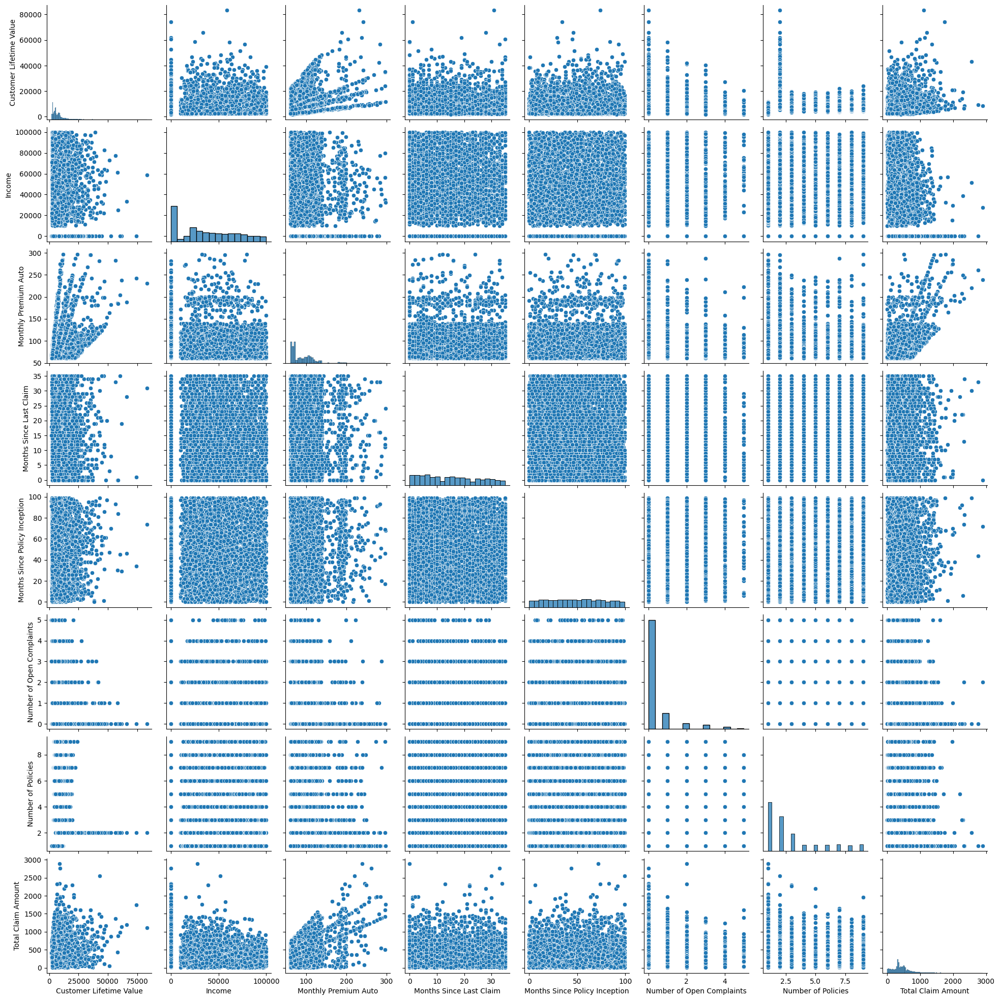
    


```python
# Use Matplotlib to construct histograms

for column in numerical.columns:
    plt.hist(numerical[column])
    plt.xlabel(column)
    plt.show()
```


    
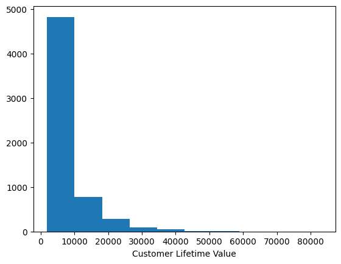
    


    
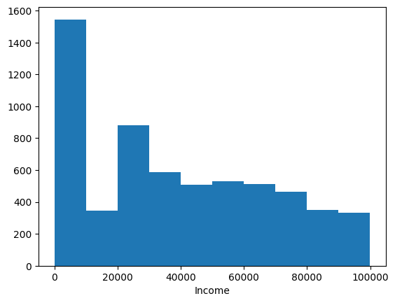
    


    
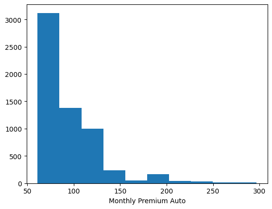
    


    
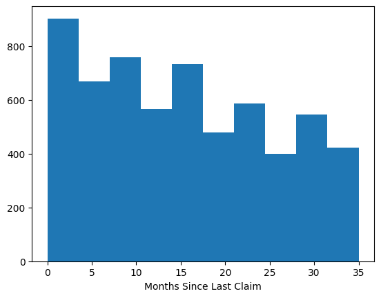
    


    
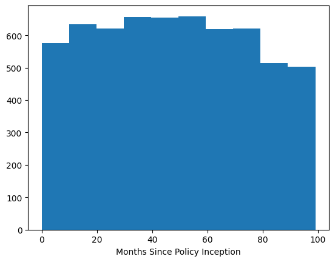
    


    
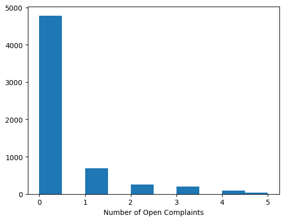
    


    
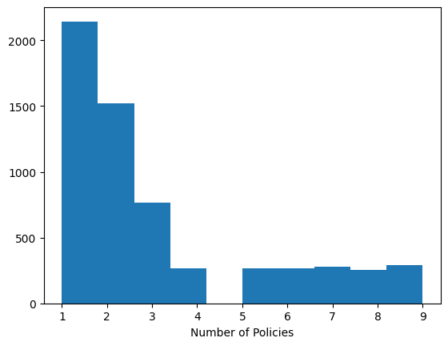
    


    
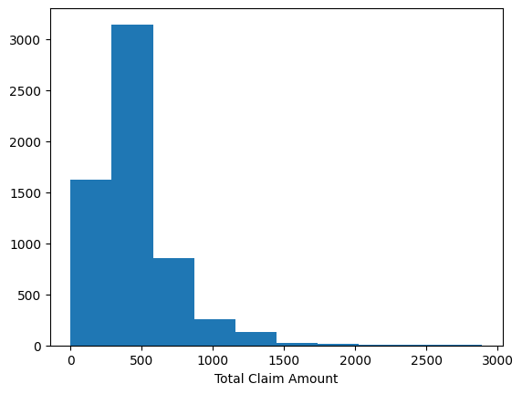
    


```python
# For the numerical variables, check the multicollinearity between the features. Please note that we will use the column total_claim_amount later as the target variable.
# look at correlations between columns
data_corr = numerical.corr()
data_corr = round(data_corr,2)
data_corr
```


<div>
<style scoped>
    .dataframe tbody tr th:only-of-type {
        vertical-align: middle;
    }

    .dataframe tbody tr th {
        vertical-align: top;
    }

    .dataframe thead th {
        text-align: right;
    }
</style>
<table border="1" class="dataframe">
  <thead>
    <tr style="text-align: right;">
      <th></th>
      <th>Customer Lifetime Value</th>
      <th>Income</th>
      <th>Monthly Premium Auto</th>
      <th>Months Since Last Claim</th>
      <th>Months Since Policy Inception</th>
      <th>Number of Open Complaints</th>
      <th>Number of Policies</th>
      <th>Total Claim Amount</th>
    </tr>
  </thead>
  <tbody>
    <tr>
      <th>Customer Lifetime Value</th>
      <td>1.00</td>
      <td>0.03</td>
      <td>0.41</td>
      <td>0.01</td>
      <td>0.02</td>
      <td>-0.03</td>
      <td>0.03</td>
      <td>0.22</td>
    </tr>
    <tr>
      <th>Income</th>
      <td>0.03</td>
      <td>1.00</td>
      <td>-0.01</td>
      <td>-0.03</td>
      <td>-0.01</td>
      <td>0.01</td>
      <td>-0.01</td>
      <td>-0.36</td>
    </tr>
    <tr>
      <th>Monthly Premium Auto</th>
      <td>0.41</td>
      <td>-0.01</td>
      <td>1.00</td>
      <td>0.00</td>
      <td>0.03</td>
      <td>-0.01</td>
      <td>-0.01</td>
      <td>0.62</td>
    </tr>
    <tr>
      <th>Months Since Last Claim</th>
      <td>0.01</td>
      <td>-0.03</td>
      <td>0.00</td>
      <td>1.00</td>
      <td>-0.03</td>
      <td>0.00</td>
      <td>0.01</td>
      <td>0.01</td>
    </tr>
    <tr>
      <th>Months Since Policy Inception</th>
      <td>0.02</td>
      <td>-0.01</td>
      <td>0.03</td>
      <td>-0.03</td>
      <td>1.00</td>
      <td>0.01</td>
      <td>-0.02</td>
      <td>0.01</td>
    </tr>
    <tr>
      <th>Number of Open Complaints</th>
      <td>-0.03</td>
      <td>0.01</td>
      <td>-0.01</td>
      <td>0.00</td>
      <td>0.01</td>
      <td>1.00</td>
      <td>-0.00</td>
      <td>-0.02</td>
    </tr>
    <tr>
      <th>Number of Policies</th>
      <td>0.03</td>
      <td>-0.01</td>
      <td>-0.01</td>
      <td>0.01</td>
      <td>-0.02</td>
      <td>-0.00</td>
      <td>1.00</td>
      <td>-0.01</td>
    </tr>
    <tr>
      <th>Total Claim Amount</th>
      <td>0.22</td>
      <td>-0.36</td>
      <td>0.62</td>
      <td>0.01</td>
      <td>0.01</td>
      <td>-0.02</td>
      <td>-0.01</td>
      <td>1.00</td>
    </tr>
  </tbody>
</table>
</div>


```python
corr_data = numerical
correlations_matrix = corr_data.corr()  # method='spearman'
correlations_matrix
```


<div>
<style scoped>
    .dataframe tbody tr th:only-of-type {
        vertical-align: middle;
    }

    .dataframe tbody tr th {
        vertical-align: top;
    }

    .dataframe thead th {
        text-align: right;
    }
</style>
<table border="1" class="dataframe">
  <thead>
    <tr style="text-align: right;">
      <th></th>
      <th>Customer Lifetime Value</th>
      <th>Income</th>
      <th>Monthly Premium Auto</th>
      <th>Months Since Last Claim</th>
      <th>Months Since Policy Inception</th>
      <th>Number of Open Complaints</th>
      <th>Number of Policies</th>
      <th>Total Claim Amount</th>
    </tr>
  </thead>
  <tbody>
    <tr>
      <th>Customer Lifetime Value</th>
      <td>1.000000</td>
      <td>0.029503</td>
      <td>0.405586</td>
      <td>0.007161</td>
      <td>0.015289</td>
      <td>-0.032507</td>
      <td>0.025723</td>
      <td>0.216628</td>
    </tr>
    <tr>
      <th>Income</th>
      <td>0.029503</td>
      <td>1.000000</td>
      <td>-0.008554</td>
      <td>-0.026139</td>
      <td>-0.007421</td>
      <td>0.012058</td>
      <td>-0.012078</td>
      <td>-0.355369</td>
    </tr>
    <tr>
      <th>Monthly Premium Auto</th>
      <td>0.405586</td>
      <td>-0.008554</td>
      <td>1.000000</td>
      <td>0.004877</td>
      <td>0.032155</td>
      <td>-0.013308</td>
      <td>-0.005964</td>
      <td>0.622094</td>
    </tr>
    <tr>
      <th>Months Since Last Claim</th>
      <td>0.007161</td>
      <td>-0.026139</td>
      <td>0.004877</td>
      <td>1.000000</td>
      <td>-0.029427</td>
      <td>0.002089</td>
      <td>0.006891</td>
      <td>0.012658</td>
    </tr>
    <tr>
      <th>Months Since Policy Inception</th>
      <td>0.015289</td>
      <td>-0.007421</td>
      <td>0.032155</td>
      <td>-0.029427</td>
      <td>1.000000</td>
      <td>0.005978</td>
      <td>-0.019976</td>
      <td>0.014804</td>
    </tr>
    <tr>
      <th>Number of Open Complaints</th>
      <td>-0.032507</td>
      <td>0.012058</td>
      <td>-0.013308</td>
      <td>0.002089</td>
      <td>0.005978</td>
      <td>1.000000</td>
      <td>-0.002493</td>
      <td>-0.020292</td>
    </tr>
    <tr>
      <th>Number of Policies</th>
      <td>0.025723</td>
      <td>-0.012078</td>
      <td>-0.005964</td>
      <td>0.006891</td>
      <td>-0.019976</td>
      <td>-0.002493</td>
      <td>1.000000</td>
      <td>-0.007070</td>
    </tr>
    <tr>
      <th>Total Claim Amount</th>
      <td>0.216628</td>
      <td>-0.355369</td>
      <td>0.622094</td>
      <td>0.012658</td>
      <td>0.014804</td>
      <td>-0.020292</td>
      <td>-0.007070</td>
      <td>1.000000</td>
    </tr>
  </tbody>
</table>
</div>


```python
# make a corr matrix 
correlations_matrix[(correlations_matrix['Total Claim Amount'] > .2) | (correlations_matrix['Total Claim Amount'] < -.2)]['Total Claim Amount']

```


    Total Claim Amount    1.0
    Name: Total Claim Amount, dtype: float64


```python
sns_plot = sns.heatmap(correlations_matrix, annot=True)
figure = sns_plot.get_figure()    
figure.savefig('svm_conf.png', dpi=400)
plt.show()
# plt.savefig('name_i_want.png')
```


    
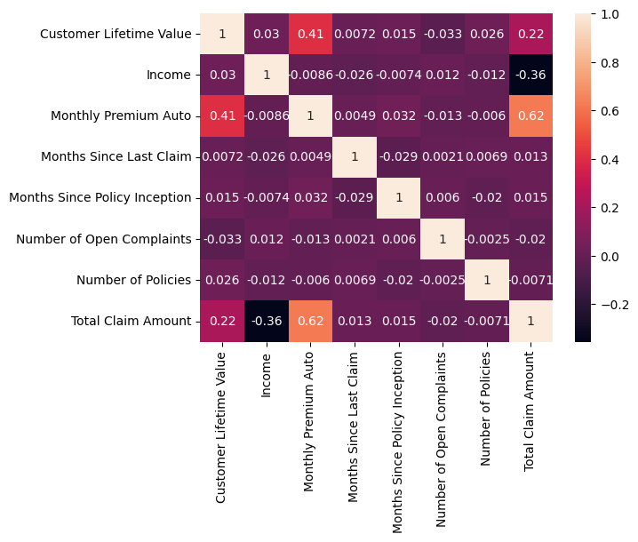
    


```python

mask = np.zeros_like(correlations_matrix)

mask[np.triu_indices_from(mask)] = True # optional, to hide repeat half of the matrix

fig, ax = plt.subplots(figsize=(10, 8))
ax = sns.heatmap(correlations_matrix, mask=mask, annot=True)
plt.show()
```


    
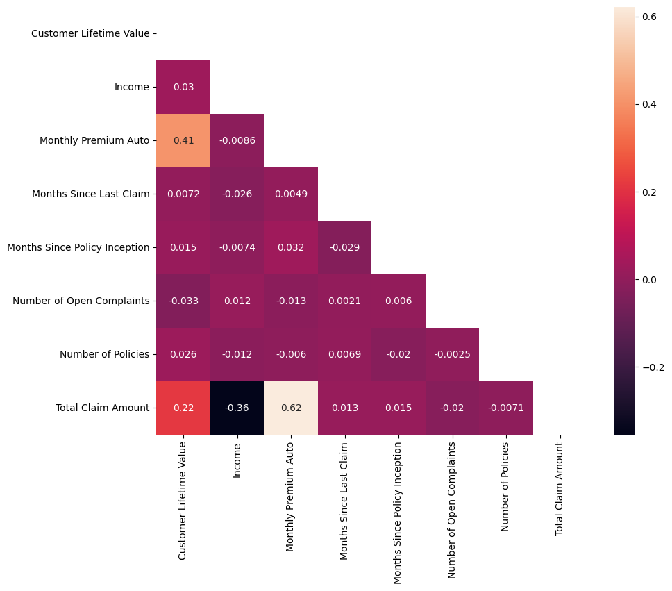
    


```python
# Do the distributions for different numerical variables look like a normal distribution
No, as they show skew 
```


```python
# Drop one of the two features that show a high correlation between them (greater than 0.9). Write code for both the correlation matrix and for seaborn heatmap. If there is no pair of features that have a high correlation, then do not drop any features
```


```python
# Customer analysis | Round 5


```


```python
# X-y split.
# We chose total claim amount as the target as it seemed to be the most logical candiate variable as it's the sum of previous columns.

y = numerical['Total Claim Amount']
X = numerical.drop(['Total Claim Amount'], axis=1)
X.head()
```


<div>
<style scoped>
    .dataframe tbody tr th:only-of-type {
        vertical-align: middle;
    }

    .dataframe tbody tr th {
        vertical-align: top;
    }

    .dataframe thead th {
        text-align: right;
    }
</style>
<table border="1" class="dataframe">
  <thead>
    <tr style="text-align: right;">
      <th></th>
      <th>Customer Lifetime Value</th>
      <th>Income</th>
      <th>Monthly Premium Auto</th>
      <th>Months Since Last Claim</th>
      <th>Months Since Policy Inception</th>
      <th>Number of Open Complaints</th>
      <th>Number of Policies</th>
    </tr>
  </thead>
  <tbody>
    <tr>
      <th>0</th>
      <td>2763.519279</td>
      <td>56274</td>
      <td>69</td>
      <td>32</td>
      <td>5</td>
      <td>0</td>
      <td>1</td>
    </tr>
    <tr>
      <th>1</th>
      <td>6979.535903</td>
      <td>0</td>
      <td>94</td>
      <td>13</td>
      <td>42</td>
      <td>0</td>
      <td>8</td>
    </tr>
    <tr>
      <th>2</th>
      <td>12887.431650</td>
      <td>48767</td>
      <td>108</td>
      <td>18</td>
      <td>38</td>
      <td>0</td>
      <td>2</td>
    </tr>
    <tr>
      <th>3</th>
      <td>7645.861827</td>
      <td>0</td>
      <td>106</td>
      <td>18</td>
      <td>65</td>
      <td>0</td>
      <td>7</td>
    </tr>
    <tr>
      <th>4</th>
      <td>2813.692575</td>
      <td>43836</td>
      <td>73</td>
      <td>12</td>
      <td>44</td>
      <td>0</td>
      <td>1</td>
    </tr>
  </tbody>
</table>
</div>


```python

```


<div>
<style scoped>
    .dataframe tbody tr th:only-of-type {
        vertical-align: middle;
    }

    .dataframe tbody tr th {
        vertical-align: top;
    }

    .dataframe thead th {
        text-align: right;
    }
</style>
<table border="1" class="dataframe">
  <thead>
    <tr style="text-align: right;">
      <th></th>
      <th>Customer Lifetime Value</th>
      <th>Income</th>
      <th>Monthly Premium Auto</th>
      <th>Months Since Last Claim</th>
      <th>Months Since Policy Inception</th>
      <th>Number of Open Complaints</th>
      <th>Number of Policies</th>
    </tr>
  </thead>
  <tbody>
    <tr>
      <th>0</th>
      <td>2763.519279</td>
      <td>56274</td>
      <td>69</td>
      <td>32</td>
      <td>5</td>
      <td>0</td>
      <td>1</td>
    </tr>
    <tr>
      <th>1</th>
      <td>6979.535903</td>
      <td>0</td>
      <td>94</td>
      <td>13</td>
      <td>42</td>
      <td>0</td>
      <td>8</td>
    </tr>
    <tr>
      <th>2</th>
      <td>12887.431650</td>
      <td>48767</td>
      <td>108</td>
      <td>18</td>
      <td>38</td>
      <td>0</td>
      <td>2</td>
    </tr>
    <tr>
      <th>3</th>
      <td>7645.861827</td>
      <td>0</td>
      <td>106</td>
      <td>18</td>
      <td>65</td>
      <td>0</td>
      <td>7</td>
    </tr>
    <tr>
      <th>4</th>
      <td>2813.692575</td>
      <td>43836</td>
      <td>73</td>
      <td>12</td>
      <td>44</td>
      <td>0</td>
      <td>1</td>
    </tr>
  </tbody>
</table>
</div>


```python
# Standardise the data 
```


```python
# Normalize (numerical)
transformer = MinMaxScaler().fit(X) # used minmax to normalise the data 
x_minmax = transformer.transform(X) #This is a an array of arrays
print(x_minmax.shape)
```

    (6061, 7)


```python

```


```python
## Make a boxplot to check for outliers and distribution 
#lab5df = numerical
#labdfbxp = sns.boxplot(data=lab5df)
#plt.setp(labdfbxp.get_xticklabels(), rotation=90)
```


    [None,
     None,
     None,
     None,
     None,
     None,
     None,
     None,
     None,
     None,
     None,
     None,
     None,
     None,
     None,
     None]


    
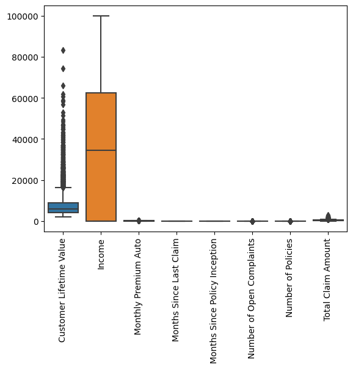
    


```python

```


```python

```


```python

```
