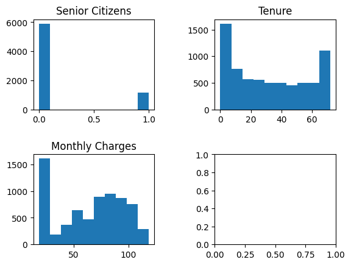
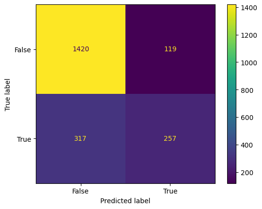

## Binary classication problem: Predicting Customer churn

In this exercise we're attemting to predict the churn rate of customers. To do this, we will use the customer churn dataset. 

### Import libraries 


```python
import pandas as pd
import numpy as np
from sklearn.linear_model import LogisticRegression
from sklearn.preprocessing import StandardScaler
from sklearn.metrics import confusion_matrix
import warnings
from sklearn.metrics import cohen_kappa_score
from matplotlib import pyplot as plt
import seaborn as sns
from sklearn import metrics


from sklearn.model_selection import train_test_split
warnings.filterwarnings('ignore')
```

### 1. Load the dataset and explore the variables.


Our data source for predicting customer churn is in a customer dataset. To start our analysis we have load the data from the csv file


```python
churnData = pd.read_csv('customer_churn.csv',sep=",")
churnData.head(5)
```


<div>
<style scoped>
    .dataframe tbody tr th:only-of-type {
        vertical-align: middle;
    }

    .dataframe tbody tr th {
        vertical-align: top;
    }

    .dataframe thead th {
        text-align: right;
    }
</style>
<table border="1" class="dataframe">
  <thead>
    <tr style="text-align: right;">
      <th></th>
      <th>customerID</th>
      <th>gender</th>
      <th>SeniorCitizen</th>
      <th>Partner</th>
      <th>Dependents</th>
      <th>tenure</th>
      <th>PhoneService</th>
      <th>MultipleLines</th>
      <th>InternetService</th>
      <th>OnlineSecurity</th>
      <th>...</th>
      <th>DeviceProtection</th>
      <th>TechSupport</th>
      <th>StreamingTV</th>
      <th>StreamingMovies</th>
      <th>Contract</th>
      <th>PaperlessBilling</th>
      <th>PaymentMethod</th>
      <th>MonthlyCharges</th>
      <th>TotalCharges</th>
      <th>Churn</th>
    </tr>
  </thead>
  <tbody>
    <tr>
      <th>0</th>
      <td>7590-VHVEG</td>
      <td>Female</td>
      <td>0</td>
      <td>Yes</td>
      <td>No</td>
      <td>1</td>
      <td>No</td>
      <td>No phone service</td>
      <td>DSL</td>
      <td>No</td>
      <td>...</td>
      <td>No</td>
      <td>No</td>
      <td>No</td>
      <td>No</td>
      <td>Month-to-month</td>
      <td>Yes</td>
      <td>Electronic check</td>
      <td>29.85</td>
      <td>29.85</td>
      <td>No</td>
    </tr>
    <tr>
      <th>1</th>
      <td>5575-GNVDE</td>
      <td>Male</td>
      <td>0</td>
      <td>No</td>
      <td>No</td>
      <td>34</td>
      <td>Yes</td>
      <td>No</td>
      <td>DSL</td>
      <td>Yes</td>
      <td>...</td>
      <td>Yes</td>
      <td>No</td>
      <td>No</td>
      <td>No</td>
      <td>One year</td>
      <td>No</td>
      <td>Mailed check</td>
      <td>56.95</td>
      <td>1889.5</td>
      <td>No</td>
    </tr>
    <tr>
      <th>2</th>
      <td>3668-QPYBK</td>
      <td>Male</td>
      <td>0</td>
      <td>No</td>
      <td>No</td>
      <td>2</td>
      <td>Yes</td>
      <td>No</td>
      <td>DSL</td>
      <td>Yes</td>
      <td>...</td>
      <td>No</td>
      <td>No</td>
      <td>No</td>
      <td>No</td>
      <td>Month-to-month</td>
      <td>Yes</td>
      <td>Mailed check</td>
      <td>53.85</td>
      <td>108.15</td>
      <td>Yes</td>
    </tr>
    <tr>
      <th>3</th>
      <td>7795-CFOCW</td>
      <td>Male</td>
      <td>0</td>
      <td>No</td>
      <td>No</td>
      <td>45</td>
      <td>No</td>
      <td>No phone service</td>
      <td>DSL</td>
      <td>Yes</td>
      <td>...</td>
      <td>Yes</td>
      <td>Yes</td>
      <td>No</td>
      <td>No</td>
      <td>One year</td>
      <td>No</td>
      <td>Bank transfer (automatic)</td>
      <td>42.30</td>
      <td>1840.75</td>
      <td>No</td>
    </tr>
    <tr>
      <th>4</th>
      <td>9237-HQITU</td>
      <td>Female</td>
      <td>0</td>
      <td>No</td>
      <td>No</td>
      <td>2</td>
      <td>Yes</td>
      <td>No</td>
      <td>Fiber optic</td>
      <td>No</td>
      <td>...</td>
      <td>No</td>
      <td>No</td>
      <td>No</td>
      <td>No</td>
      <td>Month-to-month</td>
      <td>Yes</td>
      <td>Electronic check</td>
      <td>70.70</td>
      <td>151.65</td>
      <td>Yes</td>
    </tr>
  </tbody>
</table>
<p>5 rows × 21 columns</p>
</div>


### 2. Exploring our data

First, we need to see how balanced or imbalanced our data are. Below, we can see that the target variable 'Churn' is quite imbalanced with over 70% of 'No's. 


```python
## Count instances of the target variable 
#count frequency of each value in 'Churn' column
counts = churnData['Churn'].value_counts()
##count frequency of each value in 'Churn' column as percentage of total 
pct = churnData['Churn'].value_counts(normalize=True)

#concatenate results into one DataFrame
pd.concat([counts,pct], axis=1, keys=['n', '%'])
```


<div>
<style scoped>
    .dataframe tbody tr th:only-of-type {
        vertical-align: middle;
    }

    .dataframe tbody tr th {
        vertical-align: top;
    }

    .dataframe thead th {
        text-align: right;
    }
</style>
<table border="1" class="dataframe">
  <thead>
    <tr style="text-align: right;">
      <th></th>
      <th>n</th>
      <th>%</th>
    </tr>
  </thead>
  <tbody>
    <tr>
      <th>No</th>
      <td>5174</td>
      <td>0.73463</td>
    </tr>
    <tr>
      <th>Yes</th>
      <td>1869</td>
      <td>0.26537</td>
    </tr>
  </tbody>
</table>
</div>


In this case, we have isolated 3 variables: 
- SeniorCitizen - 0 = false, 1 = true
- Tenure - 0 - 70 (time period but don't know which)
- MonthlyCharges - 19 - 119 xcurrency

We can plot the numericals to get a sense of their frequencies and distributions. 


```python
# multiple plots in the same space

fig, axs = plt.subplots(2, 2)
fig.subplots_adjust(hspace=0.5, wspace=.5) # ensure that the plots do not overlap

axs[0, 0].hist(churnData['SeniorCitizen'])
axs[0, 0].set_title('Senior Citizens')
axs[0, 1].hist(churnData['tenure'])
axs[0, 1].set_title('Tenure')
axs[1, 0].hist(churnData['MonthlyCharges'])
axs[1, 0].set_title('Monthly Charges')


plt.show()
```


    

    


## Data preparation

### 3. Extract the target variable


We need to put the target variable, in this case, a categorical data type with two possible results:
- Yes
- No 
Yes = Left / churn
No = Didn't leave / no churn

We'll make this vector 'y'


```python
y = churnData["Churn"] # create a data frame with only the 'yes' and 'no' from the 'Churn' column, the target variable aka the phenomenon that we wish to predict 
y # show the target vector 
```

### 4a. Create a dataframe with only the independent variables


Now we need to isolate the three numerical variables into a new dataframe 'numericals'.


```python
numericals = churnData.select_dtypes(include="number")
numericals.head()
```


<div>
<style scoped>
    .dataframe tbody tr th:only-of-type {
        vertical-align: middle;
    }

    .dataframe tbody tr th {
        vertical-align: top;
    }

    .dataframe thead th {
        text-align: right;
    }
</style>
<table border="1" class="dataframe">
  <thead>
    <tr style="text-align: right;">
      <th></th>
      <th>SeniorCitizen</th>
      <th>tenure</th>
      <th>MonthlyCharges</th>
    </tr>
  </thead>
  <tbody>
    <tr>
      <th>0</th>
      <td>0</td>
      <td>1</td>
      <td>29.85</td>
    </tr>
    <tr>
      <th>1</th>
      <td>0</td>
      <td>34</td>
      <td>56.95</td>
    </tr>
    <tr>
      <th>2</th>
      <td>0</td>
      <td>2</td>
      <td>53.85</td>
    </tr>
    <tr>
      <th>3</th>
      <td>0</td>
      <td>45</td>
      <td>42.30</td>
    </tr>
    <tr>
      <th>4</th>
      <td>0</td>
      <td>2</td>
      <td>70.70</td>
    </tr>
  </tbody>
</table>
</div>


### 4b. Scale the independent variables


Before applying our machine learning model, we need to scale the numerical variables. This means that we'll use the standard scaler to remove the mean and unit variance.


```python
transformer = StandardScaler().fit(numericals)
standard_x = transformer.transform(numericals)
X = pd.DataFrame(standard_x)
X.columns = numericals.columns # put the column headers back
X.head()
```


<div>
<style scoped>
    .dataframe tbody tr th:only-of-type {
        vertical-align: middle;
    }

    .dataframe tbody tr th {
        vertical-align: top;
    }

    .dataframe thead th {
        text-align: right;
    }
</style>
<table border="1" class="dataframe">
  <thead>
    <tr style="text-align: right;">
      <th></th>
      <th>SeniorCitizen</th>
      <th>tenure</th>
      <th>MonthlyCharges</th>
    </tr>
  </thead>
  <tbody>
    <tr>
      <th>0</th>
      <td>-0.439916</td>
      <td>-1.277445</td>
      <td>-1.160323</td>
    </tr>
    <tr>
      <th>1</th>
      <td>-0.439916</td>
      <td>0.066327</td>
      <td>-0.259629</td>
    </tr>
    <tr>
      <th>2</th>
      <td>-0.439916</td>
      <td>-1.236724</td>
      <td>-0.362660</td>
    </tr>
    <tr>
      <th>3</th>
      <td>-0.439916</td>
      <td>0.514251</td>
      <td>-0.746535</td>
    </tr>
    <tr>
      <th>4</th>
      <td>-0.439916</td>
      <td>-1.236724</td>
      <td>0.197365</td>
    </tr>
  </tbody>
</table>
</div>


### 5. Build the logistic regression model.


Now we have to train the model


```python
X_train, X_test, y_train, y_test = train_test_split(X, y, test_size = 0.3, random_state = 42)
```


```python
len(X_test)
```


    2113


```python
classing = LogisticRegression(random_state=0, multi_class = 'ovr').fit(X_train, y_train)
predictions = classing.predict(X_test)
```

We can use a confusion matrix to assess the accuracy the classification


```python
confusion_matrix(y_test,predictions)
```


    array([[1420,  119],
           [ 317,  257]])


Or show the matrix as a plot


```python

confusion_matrix = metrics.confusion_matrix(y_test, predictions)
cm_display = metrics.ConfusionMatrixDisplay(confusion_matrix = confusion_matrix, display_labels = [False, True])
cm_display.plot()
plt.show() 
```


    

    


<blockquote style="background-color: #FEECEF; color: #155724; border-color: #FFA0FD; padding: 10px; border-radius: 5px;">
    
**Interpreting the confusion matrix:**
    
_____________

From the above confusion matrix, we can see that we were able to predict:

- **1420 True Negatives (Top-Left Quadrant)**
- 119 False Positives (Top-Right Quadrant)
- 317 False Negatives (Bottom-Left Quadrant)
- 237 True Positives (Bottom-Right Quadrant)

This suggests that our model as some degree of accuracy. However, we still have **20%** of our predictions that are false. 
    
_____________
</blockquote>

 


### 6. Evaluate the model

Now we use sklearn 'score' method that gives us the R2 compare the regression line to the mean


```python
classing.score(X_test,y_test)
```


    0.7936583057264552


We can also use the accuracy score function from the sklearn package  to calculate the accuracy of the predicted labels against the true labels.


```python
Accuracy = metrics.accuracy_score(y_test, predictions) # same as the classing score 
Accuracy
```


    0.7936583057264552


And we get the same result


```python

```

<blockquote style="background-color: #FEECEF; color: #155724; border-color: #FFA0FD; padding: 10px; border-radius: 5px;">

We can also check our f1 score (recall and precision) which in this case is .87 for No but only .54 for Yes. 

This makes sense as we have far fewer 'yes's in our dataset. 

- No	5174	0.73463
- Yes	1869	0.26537

</blockquote>


```python
print(metrics.classification_report(y_test, predictions))
```

                  precision    recall  f1-score   support
    
              No       0.82      0.92      0.87      1539
             Yes       0.68      0.45      0.54       574
    
        accuracy                           0.79      2113
       macro avg       0.75      0.69      0.70      2113
    weighted avg       0.78      0.79      0.78      2113
    


Even a simple model will give us more than 70% accuracy. Why?


Perhaps because the differences between the two classes in the target variable are very distinct.

### Testing a less imbalanced version of the data

As we are not satisfied with how well we predicted the under-represented data 'yes's, we can manually reduce the 'yes' instances to 500 to see if this improves our accuracy. 


```python
yes = churnData[churnData['Churn']=='Yes']
no = churnData[churnData['Churn']=='No']
yes = yes.sample(500)
```


```python
no # show the no dataset
```


<div>
<style scoped>
    .dataframe tbody tr th:only-of-type {
        vertical-align: middle;
    }

    .dataframe tbody tr th {
        vertical-align: top;
    }

    .dataframe thead th {
        text-align: right;
    }
</style>
<table border="1" class="dataframe">
  <thead>
    <tr style="text-align: right;">
      <th></th>
      <th>customerID</th>
      <th>gender</th>
      <th>SeniorCitizen</th>
      <th>Partner</th>
      <th>Dependents</th>
      <th>tenure</th>
      <th>PhoneService</th>
      <th>MultipleLines</th>
      <th>InternetService</th>
      <th>OnlineSecurity</th>
      <th>...</th>
      <th>DeviceProtection</th>
      <th>TechSupport</th>
      <th>StreamingTV</th>
      <th>StreamingMovies</th>
      <th>Contract</th>
      <th>PaperlessBilling</th>
      <th>PaymentMethod</th>
      <th>MonthlyCharges</th>
      <th>TotalCharges</th>
      <th>Churn</th>
    </tr>
  </thead>
  <tbody>
    <tr>
      <th>0</th>
      <td>7590-VHVEG</td>
      <td>Female</td>
      <td>0</td>
      <td>Yes</td>
      <td>No</td>
      <td>1</td>
      <td>No</td>
      <td>No phone service</td>
      <td>DSL</td>
      <td>No</td>
      <td>...</td>
      <td>No</td>
      <td>No</td>
      <td>No</td>
      <td>No</td>
      <td>Month-to-month</td>
      <td>Yes</td>
      <td>Electronic check</td>
      <td>29.85</td>
      <td>29.85</td>
      <td>No</td>
    </tr>
    <tr>
      <th>1</th>
      <td>5575-GNVDE</td>
      <td>Male</td>
      <td>0</td>
      <td>No</td>
      <td>No</td>
      <td>34</td>
      <td>Yes</td>
      <td>No</td>
      <td>DSL</td>
      <td>Yes</td>
      <td>...</td>
      <td>Yes</td>
      <td>No</td>
      <td>No</td>
      <td>No</td>
      <td>One year</td>
      <td>No</td>
      <td>Mailed check</td>
      <td>56.95</td>
      <td>1889.5</td>
      <td>No</td>
    </tr>
    <tr>
      <th>3</th>
      <td>7795-CFOCW</td>
      <td>Male</td>
      <td>0</td>
      <td>No</td>
      <td>No</td>
      <td>45</td>
      <td>No</td>
      <td>No phone service</td>
      <td>DSL</td>
      <td>Yes</td>
      <td>...</td>
      <td>Yes</td>
      <td>Yes</td>
      <td>No</td>
      <td>No</td>
      <td>One year</td>
      <td>No</td>
      <td>Bank transfer (automatic)</td>
      <td>42.30</td>
      <td>1840.75</td>
      <td>No</td>
    </tr>
    <tr>
      <th>6</th>
      <td>1452-KIOVK</td>
      <td>Male</td>
      <td>0</td>
      <td>No</td>
      <td>Yes</td>
      <td>22</td>
      <td>Yes</td>
      <td>Yes</td>
      <td>Fiber optic</td>
      <td>No</td>
      <td>...</td>
      <td>No</td>
      <td>No</td>
      <td>Yes</td>
      <td>No</td>
      <td>Month-to-month</td>
      <td>Yes</td>
      <td>Credit card (automatic)</td>
      <td>89.10</td>
      <td>1949.4</td>
      <td>No</td>
    </tr>
    <tr>
      <th>7</th>
      <td>6713-OKOMC</td>
      <td>Female</td>
      <td>0</td>
      <td>No</td>
      <td>No</td>
      <td>10</td>
      <td>No</td>
      <td>No phone service</td>
      <td>DSL</td>
      <td>Yes</td>
      <td>...</td>
      <td>No</td>
      <td>No</td>
      <td>No</td>
      <td>No</td>
      <td>Month-to-month</td>
      <td>No</td>
      <td>Mailed check</td>
      <td>29.75</td>
      <td>301.9</td>
      <td>No</td>
    </tr>
    <tr>
      <th>...</th>
      <td>...</td>
      <td>...</td>
      <td>...</td>
      <td>...</td>
      <td>...</td>
      <td>...</td>
      <td>...</td>
      <td>...</td>
      <td>...</td>
      <td>...</td>
      <td>...</td>
      <td>...</td>
      <td>...</td>
      <td>...</td>
      <td>...</td>
      <td>...</td>
      <td>...</td>
      <td>...</td>
      <td>...</td>
      <td>...</td>
      <td>...</td>
    </tr>
    <tr>
      <th>7037</th>
      <td>2569-WGERO</td>
      <td>Female</td>
      <td>0</td>
      <td>No</td>
      <td>No</td>
      <td>72</td>
      <td>Yes</td>
      <td>No</td>
      <td>No</td>
      <td>No internet service</td>
      <td>...</td>
      <td>No internet service</td>
      <td>No internet service</td>
      <td>No internet service</td>
      <td>No internet service</td>
      <td>Two year</td>
      <td>Yes</td>
      <td>Bank transfer (automatic)</td>
      <td>21.15</td>
      <td>1419.4</td>
      <td>No</td>
    </tr>
    <tr>
      <th>7038</th>
      <td>6840-RESVB</td>
      <td>Male</td>
      <td>0</td>
      <td>Yes</td>
      <td>Yes</td>
      <td>24</td>
      <td>Yes</td>
      <td>Yes</td>
      <td>DSL</td>
      <td>Yes</td>
      <td>...</td>
      <td>Yes</td>
      <td>Yes</td>
      <td>Yes</td>
      <td>Yes</td>
      <td>One year</td>
      <td>Yes</td>
      <td>Mailed check</td>
      <td>84.80</td>
      <td>1990.5</td>
      <td>No</td>
    </tr>
    <tr>
      <th>7039</th>
      <td>2234-XADUH</td>
      <td>Female</td>
      <td>0</td>
      <td>Yes</td>
      <td>Yes</td>
      <td>72</td>
      <td>Yes</td>
      <td>Yes</td>
      <td>Fiber optic</td>
      <td>No</td>
      <td>...</td>
      <td>Yes</td>
      <td>No</td>
      <td>Yes</td>
      <td>Yes</td>
      <td>One year</td>
      <td>Yes</td>
      <td>Credit card (automatic)</td>
      <td>103.20</td>
      <td>7362.9</td>
      <td>No</td>
    </tr>
    <tr>
      <th>7040</th>
      <td>4801-JZAZL</td>
      <td>Female</td>
      <td>0</td>
      <td>Yes</td>
      <td>Yes</td>
      <td>11</td>
      <td>No</td>
      <td>No phone service</td>
      <td>DSL</td>
      <td>Yes</td>
      <td>...</td>
      <td>No</td>
      <td>No</td>
      <td>No</td>
      <td>No</td>
      <td>Month-to-month</td>
      <td>Yes</td>
      <td>Electronic check</td>
      <td>29.60</td>
      <td>346.45</td>
      <td>No</td>
    </tr>
    <tr>
      <th>7042</th>
      <td>3186-AJIEK</td>
      <td>Male</td>
      <td>0</td>
      <td>No</td>
      <td>No</td>
      <td>66</td>
      <td>Yes</td>
      <td>No</td>
      <td>Fiber optic</td>
      <td>Yes</td>
      <td>...</td>
      <td>Yes</td>
      <td>Yes</td>
      <td>Yes</td>
      <td>Yes</td>
      <td>Two year</td>
      <td>Yes</td>
      <td>Bank transfer (automatic)</td>
      <td>105.65</td>
      <td>6844.5</td>
      <td>No</td>
    </tr>
  </tbody>
</table>
<p>5174 rows × 21 columns</p>
</div>


```python
yes # show the yes dataset
```


<div>
<style scoped>
    .dataframe tbody tr th:only-of-type {
        vertical-align: middle;
    }

    .dataframe tbody tr th {
        vertical-align: top;
    }

    .dataframe thead th {
        text-align: right;
    }
</style>
<table border="1" class="dataframe">
  <thead>
    <tr style="text-align: right;">
      <th></th>
      <th>customerID</th>
      <th>gender</th>
      <th>SeniorCitizen</th>
      <th>Partner</th>
      <th>Dependents</th>
      <th>tenure</th>
      <th>PhoneService</th>
      <th>MultipleLines</th>
      <th>InternetService</th>
      <th>OnlineSecurity</th>
      <th>...</th>
      <th>DeviceProtection</th>
      <th>TechSupport</th>
      <th>StreamingTV</th>
      <th>StreamingMovies</th>
      <th>Contract</th>
      <th>PaperlessBilling</th>
      <th>PaymentMethod</th>
      <th>MonthlyCharges</th>
      <th>TotalCharges</th>
      <th>Churn</th>
    </tr>
  </thead>
  <tbody>
    <tr>
      <th>5345</th>
      <td>9526-JAWYF</td>
      <td>Male</td>
      <td>0</td>
      <td>No</td>
      <td>No</td>
      <td>26</td>
      <td>Yes</td>
      <td>No</td>
      <td>Fiber optic</td>
      <td>No</td>
      <td>...</td>
      <td>Yes</td>
      <td>No</td>
      <td>Yes</td>
      <td>No</td>
      <td>Month-to-month</td>
      <td>No</td>
      <td>Electronic check</td>
      <td>89.80</td>
      <td>2335.3</td>
      <td>Yes</td>
    </tr>
    <tr>
      <th>1849</th>
      <td>0621-TWIEM</td>
      <td>Male</td>
      <td>0</td>
      <td>No</td>
      <td>No</td>
      <td>10</td>
      <td>Yes</td>
      <td>No</td>
      <td>DSL</td>
      <td>No</td>
      <td>...</td>
      <td>No</td>
      <td>No</td>
      <td>No</td>
      <td>No</td>
      <td>Month-to-month</td>
      <td>Yes</td>
      <td>Electronic check</td>
      <td>45.55</td>
      <td>402.6</td>
      <td>Yes</td>
    </tr>
    <tr>
      <th>3525</th>
      <td>5889-JTMUL</td>
      <td>Female</td>
      <td>1</td>
      <td>Yes</td>
      <td>No</td>
      <td>50</td>
      <td>Yes</td>
      <td>Yes</td>
      <td>Fiber optic</td>
      <td>No</td>
      <td>...</td>
      <td>Yes</td>
      <td>No</td>
      <td>Yes</td>
      <td>No</td>
      <td>Month-to-month</td>
      <td>Yes</td>
      <td>Electronic check</td>
      <td>95.05</td>
      <td>4888.7</td>
      <td>Yes</td>
    </tr>
    <tr>
      <th>5683</th>
      <td>5057-LCOUI</td>
      <td>Female</td>
      <td>0</td>
      <td>No</td>
      <td>No</td>
      <td>39</td>
      <td>No</td>
      <td>No phone service</td>
      <td>DSL</td>
      <td>No</td>
      <td>...</td>
      <td>Yes</td>
      <td>No</td>
      <td>Yes</td>
      <td>Yes</td>
      <td>Month-to-month</td>
      <td>Yes</td>
      <td>Electronic check</td>
      <td>50.75</td>
      <td>2011.4</td>
      <td>Yes</td>
    </tr>
    <tr>
      <th>408</th>
      <td>4800-VHZKI</td>
      <td>Female</td>
      <td>0</td>
      <td>No</td>
      <td>No</td>
      <td>1</td>
      <td>Yes</td>
      <td>No</td>
      <td>No</td>
      <td>No internet service</td>
      <td>...</td>
      <td>No internet service</td>
      <td>No internet service</td>
      <td>No internet service</td>
      <td>No internet service</td>
      <td>Month-to-month</td>
      <td>Yes</td>
      <td>Mailed check</td>
      <td>19.90</td>
      <td>19.9</td>
      <td>Yes</td>
    </tr>
    <tr>
      <th>...</th>
      <td>...</td>
      <td>...</td>
      <td>...</td>
      <td>...</td>
      <td>...</td>
      <td>...</td>
      <td>...</td>
      <td>...</td>
      <td>...</td>
      <td>...</td>
      <td>...</td>
      <td>...</td>
      <td>...</td>
      <td>...</td>
      <td>...</td>
      <td>...</td>
      <td>...</td>
      <td>...</td>
      <td>...</td>
      <td>...</td>
      <td>...</td>
    </tr>
    <tr>
      <th>4448</th>
      <td>6543-XRMYR</td>
      <td>Female</td>
      <td>1</td>
      <td>No</td>
      <td>No</td>
      <td>30</td>
      <td>Yes</td>
      <td>Yes</td>
      <td>Fiber optic</td>
      <td>No</td>
      <td>...</td>
      <td>No</td>
      <td>No</td>
      <td>Yes</td>
      <td>Yes</td>
      <td>Month-to-month</td>
      <td>Yes</td>
      <td>Electronic check</td>
      <td>99.70</td>
      <td>2967.35</td>
      <td>Yes</td>
    </tr>
    <tr>
      <th>5179</th>
      <td>9048-JVYVF</td>
      <td>Male</td>
      <td>0</td>
      <td>No</td>
      <td>No</td>
      <td>3</td>
      <td>Yes</td>
      <td>No</td>
      <td>DSL</td>
      <td>No</td>
      <td>...</td>
      <td>No</td>
      <td>Yes</td>
      <td>Yes</td>
      <td>Yes</td>
      <td>Month-to-month</td>
      <td>Yes</td>
      <td>Electronic check</td>
      <td>69.35</td>
      <td>191.35</td>
      <td>Yes</td>
    </tr>
    <tr>
      <th>2673</th>
      <td>8429-XIBUM</td>
      <td>Male</td>
      <td>0</td>
      <td>No</td>
      <td>No</td>
      <td>22</td>
      <td>Yes</td>
      <td>Yes</td>
      <td>Fiber optic</td>
      <td>Yes</td>
      <td>...</td>
      <td>No</td>
      <td>No</td>
      <td>Yes</td>
      <td>Yes</td>
      <td>Month-to-month</td>
      <td>Yes</td>
      <td>Bank transfer (automatic)</td>
      <td>101.35</td>
      <td>2317.1</td>
      <td>Yes</td>
    </tr>
    <tr>
      <th>1751</th>
      <td>9436-ZBZCT</td>
      <td>Male</td>
      <td>0</td>
      <td>No</td>
      <td>No</td>
      <td>14</td>
      <td>Yes</td>
      <td>Yes</td>
      <td>Fiber optic</td>
      <td>No</td>
      <td>...</td>
      <td>No</td>
      <td>Yes</td>
      <td>Yes</td>
      <td>No</td>
      <td>Month-to-month</td>
      <td>Yes</td>
      <td>Electronic check</td>
      <td>89.95</td>
      <td>1178.4</td>
      <td>Yes</td>
    </tr>
    <tr>
      <th>5992</th>
      <td>0687-ZVTHB</td>
      <td>Male</td>
      <td>0</td>
      <td>Yes</td>
      <td>Yes</td>
      <td>65</td>
      <td>Yes</td>
      <td>Yes</td>
      <td>DSL</td>
      <td>Yes</td>
      <td>...</td>
      <td>Yes</td>
      <td>No</td>
      <td>No</td>
      <td>Yes</td>
      <td>One year</td>
      <td>No</td>
      <td>Credit card (automatic)</td>
      <td>72.45</td>
      <td>4653.85</td>
      <td>Yes</td>
    </tr>
  </tbody>
</table>
<p>500 rows × 21 columns</p>
</div>


Which gives us a 91-9% ratio of no to yes


```python
## Count instances of the target variable 
#count frequency of each value in 'Churn' column
counts = data['Churn'].value_counts()
##count frequency of each value in 'Churn' column as percentage of total 
pct = data['Churn'].value_counts(normalize=True)

#concatenate results into one DataFrame
pd.concat([counts,pct], axis=1, keys=['n', '%'])
```


<div>
<style scoped>
    .dataframe tbody tr th:only-of-type {
        vertical-align: middle;
    }

    .dataframe tbody tr th {
        vertical-align: top;
    }

    .dataframe thead th {
        text-align: right;
    }
</style>
<table border="1" class="dataframe">
  <thead>
    <tr style="text-align: right;">
      <th></th>
      <th>n</th>
      <th>%</th>
    </tr>
  </thead>
  <tbody>
    <tr>
      <th>No</th>
      <td>5174</td>
      <td>0.911879</td>
    </tr>
    <tr>
      <th>Yes</th>
      <td>500</td>
      <td>0.088121</td>
    </tr>
  </tbody>
</table>
</div>


```python
#shuffling the data
data = data.sample(frac=1)
data.head()
```


<div>
<style scoped>
    .dataframe tbody tr th:only-of-type {
        vertical-align: middle;
    }

    .dataframe tbody tr th {
        vertical-align: top;
    }

    .dataframe thead th {
        text-align: right;
    }
</style>
<table border="1" class="dataframe">
  <thead>
    <tr style="text-align: right;">
      <th></th>
      <th>customerID</th>
      <th>gender</th>
      <th>SeniorCitizen</th>
      <th>Partner</th>
      <th>Dependents</th>
      <th>tenure</th>
      <th>PhoneService</th>
      <th>MultipleLines</th>
      <th>InternetService</th>
      <th>OnlineSecurity</th>
      <th>...</th>
      <th>DeviceProtection</th>
      <th>TechSupport</th>
      <th>StreamingTV</th>
      <th>StreamingMovies</th>
      <th>Contract</th>
      <th>PaperlessBilling</th>
      <th>PaymentMethod</th>
      <th>MonthlyCharges</th>
      <th>TotalCharges</th>
      <th>Churn</th>
    </tr>
  </thead>
  <tbody>
    <tr>
      <th>4659</th>
      <td>6616-AALSR</td>
      <td>Female</td>
      <td>0</td>
      <td>Yes</td>
      <td>Yes</td>
      <td>65</td>
      <td>Yes</td>
      <td>Yes</td>
      <td>Fiber optic</td>
      <td>Yes</td>
      <td>...</td>
      <td>Yes</td>
      <td>No</td>
      <td>Yes</td>
      <td>Yes</td>
      <td>Two year</td>
      <td>Yes</td>
      <td>Credit card (automatic)</td>
      <td>104.30</td>
      <td>6725.3</td>
      <td>No</td>
    </tr>
    <tr>
      <th>5796</th>
      <td>8571-ZCMCX</td>
      <td>Female</td>
      <td>0</td>
      <td>Yes</td>
      <td>Yes</td>
      <td>47</td>
      <td>No</td>
      <td>No phone service</td>
      <td>DSL</td>
      <td>Yes</td>
      <td>...</td>
      <td>Yes</td>
      <td>No</td>
      <td>Yes</td>
      <td>Yes</td>
      <td>Two year</td>
      <td>Yes</td>
      <td>Credit card (automatic)</td>
      <td>60.00</td>
      <td>2768.65</td>
      <td>No</td>
    </tr>
    <tr>
      <th>5028</th>
      <td>0254-FNMCI</td>
      <td>Female</td>
      <td>0</td>
      <td>No</td>
      <td>No</td>
      <td>72</td>
      <td>Yes</td>
      <td>No</td>
      <td>Fiber optic</td>
      <td>Yes</td>
      <td>...</td>
      <td>Yes</td>
      <td>Yes</td>
      <td>Yes</td>
      <td>Yes</td>
      <td>Two year</td>
      <td>Yes</td>
      <td>Electronic check</td>
      <td>109.90</td>
      <td>7624.2</td>
      <td>No</td>
    </tr>
    <tr>
      <th>5260</th>
      <td>2495-KZNFB</td>
      <td>Female</td>
      <td>0</td>
      <td>No</td>
      <td>No</td>
      <td>33</td>
      <td>Yes</td>
      <td>Yes</td>
      <td>Fiber optic</td>
      <td>Yes</td>
      <td>...</td>
      <td>No</td>
      <td>No</td>
      <td>No</td>
      <td>Yes</td>
      <td>Month-to-month</td>
      <td>Yes</td>
      <td>Electronic check</td>
      <td>90.65</td>
      <td>2989.6</td>
      <td>No</td>
    </tr>
    <tr>
      <th>1716</th>
      <td>5515-RUGKN</td>
      <td>Male</td>
      <td>0</td>
      <td>No</td>
      <td>No</td>
      <td>8</td>
      <td>Yes</td>
      <td>No</td>
      <td>DSL</td>
      <td>No</td>
      <td>...</td>
      <td>No</td>
      <td>No</td>
      <td>No</td>
      <td>Yes</td>
      <td>Month-to-month</td>
      <td>Yes</td>
      <td>Credit card (automatic)</td>
      <td>54.75</td>
      <td>438.05</td>
      <td>No</td>
    </tr>
  </tbody>
</table>
<p>5 rows × 21 columns</p>
</div>


We then repeat the above steps and this gives us a R2 score of .9


```python
numericData = data[['tenure', 'SeniorCitizen','MonthlyCharges']]
transformer = StandardScaler().fit(data[['tenure','SeniorCitizen','MonthlyCharges']])
scaled_x = transformer.transform(data[['tenure','SeniorCitizen','MonthlyCharges']])

y = pd.DataFrame(data=data, columns=['Churn'])


X_train, X_test, y_train, y_test = train_test_split(scaled_x, y, test_size=0.3, random_state=100)
classification = LogisticRegression(random_state=0, multi_class='ovr').fit(X_train, y_train)
predictions = classification.predict(X_test)

classification.score(X_test, y_test)
```


    0.913681738109219


<blockquote style="background-color: #FEECEF; color: #155724; border-color: #FFA0FD; padding: 10px; border-radius: 5px;">

🚩 However for the 'yes' class, it only gives us 0.00 precision! 

</blockquote>


```python
from sklearn.metrics import classification_report
print(classification_report(y_test, predictions))
```

                  precision    recall  f1-score   support
    
              No       0.91      1.00      0.95      1558
             Yes       0.00      0.00      0.00       145
    
        accuracy                           0.91      1703
       macro avg       0.46      0.50      0.48      1703
    weighted avg       0.84      0.91      0.87      1703
    


### Manual upsampling

Down sampling didn't work. It made predicting no more accurate but yes with even less accuracy. Now we can upsample the minority class by repeating samples from the minority class to create a more balanced dataset. 


```python
## Count instances of the target variable 
#count frequency of each value in 'Churn' column
counts = churnData['Churn'].value_counts()
##count frequency of each value in 'Churn' column as percentage of total 
pct = churnData['Churn'].value_counts(normalize=True)

#concatenate results into one DataFrame
pd.concat([counts,pct], axis=1, keys=['n', '%'])
```


<div>
<style scoped>
    .dataframe tbody tr th:only-of-type {
        vertical-align: middle;
    }

    .dataframe tbody tr th {
        vertical-align: top;
    }

    .dataframe thead th {
        text-align: right;
    }
</style>
<table border="1" class="dataframe">
  <thead>
    <tr style="text-align: right;">
      <th></th>
      <th>n</th>
      <th>%</th>
    </tr>
  </thead>
  <tbody>
    <tr>
      <th>No</th>
      <td>5174</td>
      <td>0.73463</td>
    </tr>
    <tr>
      <th>Yes</th>
      <td>1869</td>
      <td>0.26537</td>
    </tr>
  </tbody>
</table>
</div>


As we can see, we have the original 73-26 balance of yes and no


```python
yes = churnData[churnData['Churn']=='Yes'].sample(counts[0], replace=True)
no = churnData[churnData['Churn']=='No']
data = pd.concat([yes,no], axis=0)
data = data.sample(frac=1)
data['Churn'].value_counts()
```


    ---------------------------------------------------------------------------

    NameError                                 Traceback (most recent call last)

    Cell In[1], line 1
    ----> 1 yes = churnData[churnData['Churn']=='Yes'].sample(counts[0], replace=True)
          2 no = churnData[churnData['Churn']=='No']
          3 data = pd.concat([yes,no], axis=0)


    NameError: name 'churnData' is not defined


Using the `frac` function we've created a perfectly balanced dataset. We can now re-run the logistic regresssion and test for accuracy and precision. 


```python
numericData = data[['tenure', 'SeniorCitizen','MonthlyCharges']]
transformer = StandardScaler().fit(data[['tenure','SeniorCitizen','MonthlyCharges']])
scaled_x = transformer.transform(data[['tenure','SeniorCitizen','MonthlyCharges']])

y = pd.DataFrame(data=data, columns=['Churn'])


X_train, X_test, y_train, y_test = train_test_split(scaled_x, y, test_size=0.3, random_state=100)
classification = LogisticRegression(random_state=0, multi_class='ovr').fit(X_train, y_train)
predictions = classification.predict(X_test)

classification.score(X_test, y_test)
```


    0.7297906602254428


If we run the classification report, we get equally precise (or imprecise) results. 


```python
print(classification_report(y_test, predictions))
```

                  precision    recall  f1-score   support
    
              No       0.73      0.73      0.73      1551
             Yes       0.73      0.73      0.73      1554
    
        accuracy                           0.73      3105
       macro avg       0.73      0.73      0.73      3105
    weighted avg       0.73      0.73      0.73      3105
    


### Upsampling and downsampling with the `imblearn` library
Other more sophisticated resapling techniques include:

Cluster the records of the majority class, and do the under-sampling by removing records from each cluster, thus seeking to preserve information. 
In over-sampling, instead of creating exact copies of the minority class records, we can introduce small variations into those copies, creating more diverse synthetic samples.

```python
#!pip install imblearn
```


```python
from imblearn.under_sampling import RandomUnderSampler #import functions from imblearn
from imblearn.over_sampling import RandomOverSampler
```


```python

```

### Downsampling


```python
rus = RandomUnderSampler()
X = churnData[['tenure', 'SeniorCitizen','MonthlyCharges']]
transformer = StandardScaler().fit(X)
X = transformer.transform(X)
y = churnData['Churn']
X_rus, y_rus = rus.fit_resample(X, y)
```


```python
y.value_counts()
```


    No     5174
    Yes    1869
    Name: Churn, dtype: int64


```python
y_rus.value_counts()
```


    No     1869
    Yes    1869
    Name: Churn, dtype: int64


```python
transformer = StandardScaler().fit(X_rus)
X = transformer.transform(X_rus)


X_train, X_test, y_train, y_test = train_test_split(X, y_rus, test_size=0.3, random_state=100)
classification = LogisticRegression(random_state=0, multi_class='ovr').fit(X_train, y_train)
predictions = classification.predict(X_test)

classification.score(X_test, y_test)
```


    0.7335115864527629


Even with less data the results are very to those done with manual upsampling.

### Upsampling

We can use a random upsampling method. 


```python
ros = RandomOverSampler()
X = churnData[['tenure', 'SeniorCitizen','MonthlyCharges']]
transformer = StandardScaler().fit(X)
X = transformer.transform(X)
y = churnData['Churn']
X_ros, y_ros = ros.fit_resample(X, y)
```


```python
y.value_counts()
```


    No     5174
    Yes    1869
    Name: Churn, dtype: int64


```python
y_ros.value_counts()
```


    No     5174
    Yes    5174
    Name: Churn, dtype: int64


```python
transformer = StandardScaler().fit(X_ros)
X = transformer.transform(X_ros)

X_train, X_test, y_train, y_test = train_test_split(X, y_ros, test_size=0.3, random_state=100)
classification = LogisticRegression(random_state=0, multi_class='ovr').fit(X_train, y_train)
predictions = classification.predict(X_test)

classification.score(X_test, y_test)
```


    0.736231884057971


More records to train the model but also similar results.

### Synthetic Minority Oversampling TEchnique (SMOTE)

**SMOTE** create as many fake samples from the minority class as needed in order to balance the classes. 

The SMOTE algorithm can be broken down into foll. steps:
Randomly pick a point from the minority class.
Compute the k-nearest neighbors (for some pre-specified k) for this point.
Add k new points somewhere between the chosen point and each of its neighbors.


```python
from imblearn.over_sampling import SMOTE
smote = SMOTE()
X = churnData[['tenure', 'SeniorCitizen','MonthlyCharges']]
transformer = StandardScaler().fit(X)
X = transformer.transform(X)
y = churnData['Churn']
X_sm, y_sm = smote.fit_resample(X, y)
y_sm.value_counts()
```


    No     5174
    Yes    5174
    Name: Churn, dtype: int64


```python
X_train, X_test, y_train, y_test = train_test_split(X_sm, y_sm, test_size=0.3, random_state=100)
classification = LogisticRegression(random_state=0, multi_class='ovr').fit(X_train, y_train)
predictions = classification.predict(X_test)

classification.score(X_test, y_test)
```


    0.7484702093397746


No such a big improvement...can you guess why?

### UnderSampling using TomekLinks 

Tomek links are pairs of very close instances, but of opposite classes. Removing the instances of the majority class of each pair increases the space between the two classes, facilitating the classification process.


```python
from imblearn.under_sampling import TomekLinks

tl = TomekLinks(sampling_strategy='majority')
X_tl, y_tl = tl.fit_resample(X, y)
y_tl.value_counts(normalize=True)
```


    No     0.715222
    Yes    0.284778
    Name: Churn, dtype: float64


It does not make the two classes equal but only removes the points from the majority 
class that are close to other points in minority class. The relative % difference between the two classes has changed by only 2 points, and precision for 'yes' has decreased by 1 point but the f1 score has increased by 6 points. 


```python
X_train, X_test, y_train, y_test = train_test_split(X_tl, y_tl, test_size=0.3, random_state=100)
classification = LogisticRegression(random_state=0, multi_class='ovr').fit(X_train, y_train)
predictions = classification.predict(X_test)

classification.score(X_test, y_test)
```


    0.7973590655154901


```python
from sklearn.metrics import classification_report
print(classification_report(y_test, predictions))
```

                  precision    recall  f1-score   support
    
              No       0.83      0.90      0.86      1413
             Yes       0.67      0.54      0.60       556
    
        accuracy                           0.80      1969
       macro avg       0.75      0.72      0.73      1969
    weighted avg       0.79      0.80      0.79      1969
    


<blockquote style="background-color: #FEECEF; color: #155724; border-color: #FFA0FD; padding: 10px; border-radius: 5px;">

**Conclusions:**
    
_____________

Despite several attempts to improve the precision and accuracy:
- It was difficult to get above 80% 
- Under or over sampling skewed the f1 score for either of the one classes 

**Next steps:**
_____________
Experiment with adjusting  the class weights: 
-Set higher weights for the minority class and lower weights for the majority class. I found this one to experiment with: 

`from sklearn.linear_model import LogisticRegression`

`# Instantiate the Logistic Regression model with class weights`

`lr = LogisticRegression(class_weight='balanced')`

`# Fit the model to your imbalanced dataset`

`lr.fit(X_train, y_train)`

`# Predict on your test set`

`y_pred = lr.predict(X_test)`

</blockquote>
